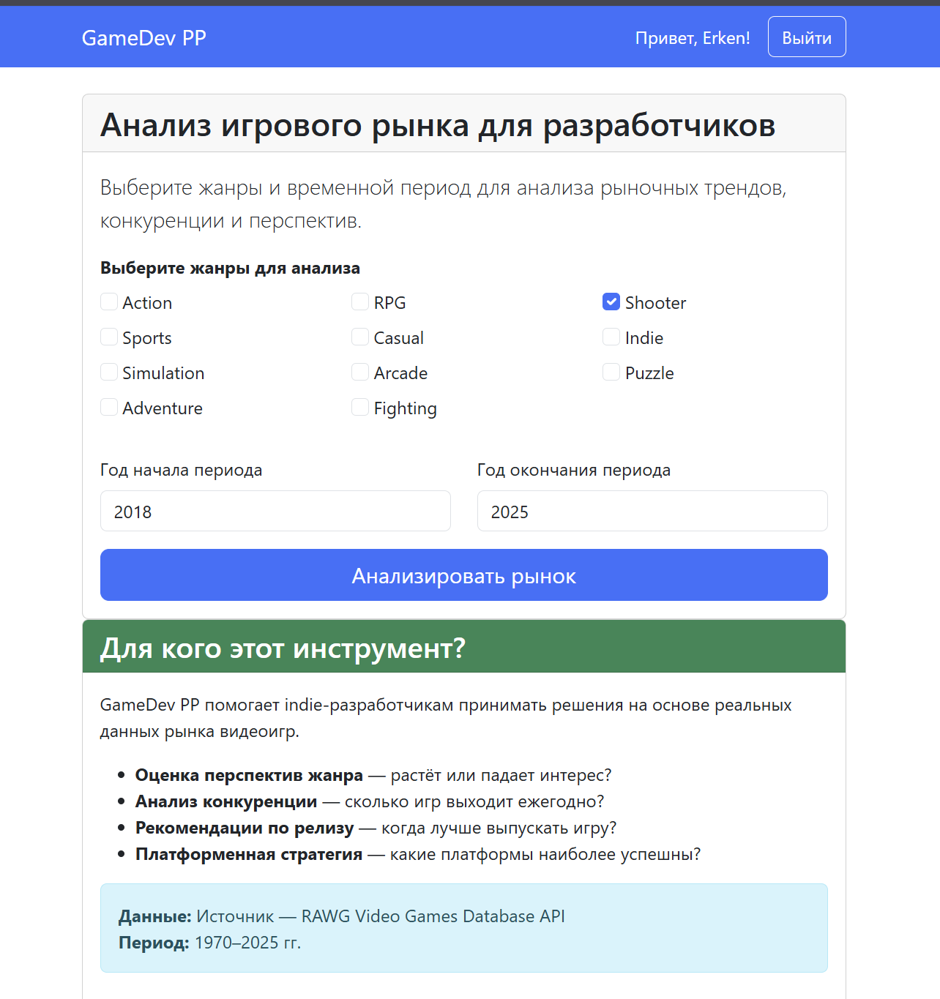
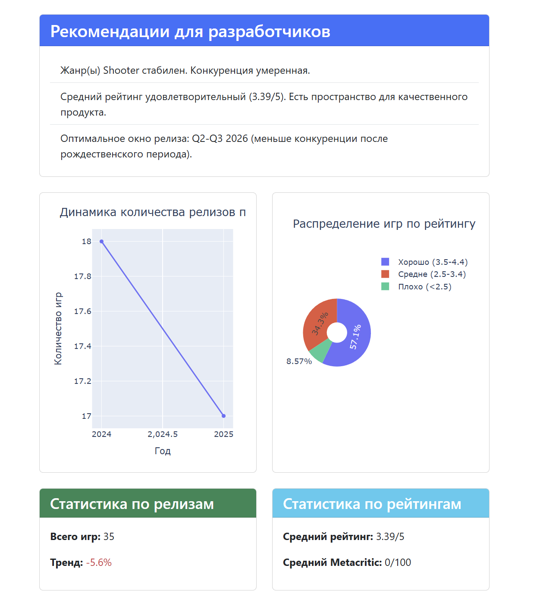

# GameDev PP

Аналитическая платформа для indie-разработчиков видеоигр. Помогает оценить перспективы жанра, конкуренцию и оптимальное время релиза на основе данных из RAWG API.

**Демо:** [https://erkenn.pythonanywhere.com](https://erkenn.pythonanywhere.com)

## Технологии
- **Backend**: Python 3.10, Django 6.0
- **API**: RAWG Video Games Database
- **Аналитика**: Pandas, Plotly
- **Frontend**: Bootstrap 5, JavaScript

## Скриншоты

*Форма выбора жанров и периода*


*Графики, рекомендации и список игр*

## Как запустить локально
1. Клонируйте репозиторий:
   ```bash
   git clone https://github.com/Erkenn/PP.git
   cd PP
2. Создайте и актививируйте виртуальное окружение:
   ```bash
   python -m venv venv
   # Linux/macOS:
   source venv/bin/activate
   # Windows:
   venv\Scripts\activate
3. Установите зависимости
   ```bash
   pip install -r requirements.txt
4. Настройте переменные окружения:
   Создайте файл .env в корне проекта:
   SECRET_KEY=ключ_django
   RAWG_API_KEY=api_ключ_из_RAWG
   Получить API-ключ можно на RAWG Developer Portal
5. Выполните миграции и запустите сервер:
   python manage.py migrate
   python manage.py runserver
6. Откройте в браузере:
   http://127.0.0.1:8000
   